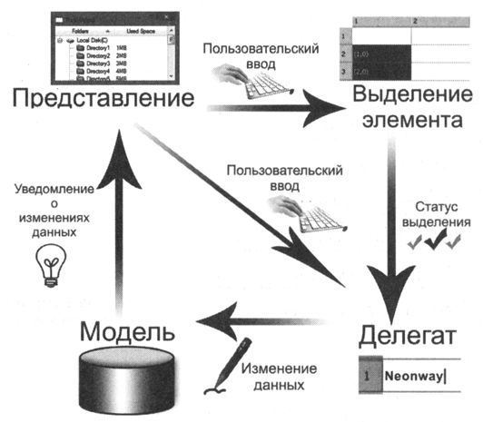
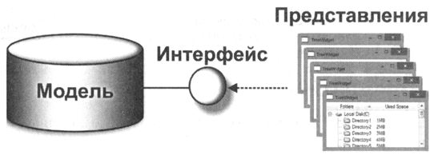
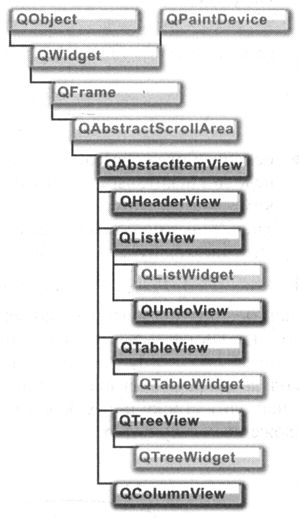

Qt предоставляет технологию, называемую «интервью», или, иначе,
"модель-представление". Архитектура «модель-представление», реализованная в Qt,
не является прямой реализацией шаблона проектирования «модель-представление», а
использует только основные его идеи, такие как, например, отделение данных от их
представления.

Концепция «интервью» является свободной вариацией шаблона разработки «модель-представление»,
адаптированного специально для элементов данных. Она отделяет данные
от их представления, что делает возможным отображение одних и тех же данных в различных
представлениях по-разному, без каких-либо изменений лежащей в основе структуры
самих данных.

Благодаря такому подходу можно разделять между представлениями не только модель данных,
но и выделение самих элементов в представлениях.



- модель - отвечает за управление данными и предоставляет интерфейс для чтения и записи данных;
- представление - отвечает за представление данных пользователю и за их расположение;
- выделение элемента - специальная модель, отвечающая за централизованное использование выделений элементов;
- делегат - отвечает за рисование каждого элемента в отдельности, а также за его редактирование.

Классы представлений практически всегда используются как есть. Наследовать чаще всего
приходится от классов моделей и иногда от классов делегатов.

# Модель

Модель - это оболочка вокруг исходных данных, предоставляющая стандартный
интерфейс для доступа к ним. Так как именно интерфейс модели является основной
единицей, обеспечивающей связь между моделью и представлением, это дает
дополнительные преимущества, а именно: модели можно разрабатывать отдельно друг
от друга и при необходимости заменять одну на другую. Интерфейс любой Qt-модели
базируется на классе ```QAbstractItemМodel```. Для того чтобы создать свою собственную
модель, придется унаследовать либо этот класс, либо один из его потомков.

- ```QObject```
  - ```QAbstractItemModel```
    - ```QFlleSystemModel``` - готовый класс иерархии файловой системы.
    - ```QStandardItemModel``` - позволяет напрямую сохранять данные в модели. Хоть это и немного противоречит основной идее «модель-представление», но в некоторых приложениях, которые манипулируют незначительным количеством данных, является довольно удобным и практичным компромиссом.
    - ```QAbstractListModel``` - одномерный список.
      - ```QStringListModel``` - одномерная модель, предназначенная для работы со списком строк. Список строк (```QStringList```)- здесь источник данных. Эта модель предоставляет возможность редактирования, то есть если пользователь с помощью представления изменит одну из записей, то старая запись будет замещена новой. Каждая запись соответствует одной строке.
    - ```QAbstractProxyModel``` - основная идея класса состоит в извлечении данных из модели, проведении некоторых манипуляций с ними и возвращении их в качестве новой модели. Таким образом можно осуществлять выборку и сортировку данных.
      - ```QIdentityProxyModel```
      - ```QSortFilterProxyModel```
    - ```QAbstractТableModel``` - двумерная таблица.
      - ```QSqlQueryModel```
      - ```QSqlTableModel```
      - ```QSqlRelationalТableModel```

Данные, предоставляемые моделями, могут посредством интерфейса совместно
использоваться различными представлениями (виджетами, унаследованными от
```QAbstractItemView```). Дпя того чтобы модель и представление могли понимать друг
друга, модель информирована об основных свойствах представления: каждая запись
занимает в ней одну строку и столбец, а также может иметь индекс, который играет
важную роль во вложенных структурах.



Базовым классом подавляющего большинства классов представлений является класс
```QAbstactScrollArea```, что позволяет в тех случаях, когда отображаемая информация
занимает больше места , чем область показа, воспользоваться полосами прокрутки.

# Представление



- ```QObject```
  - ```QWidget```
    - ```QFrame```
      - ```QAbstactScrollArea```
        - ```QAbstractItemView``` - дает для всех представлений такие базовые возможности, как, например, установка моделей в представлении, методы для прокрутки изображения и многие другие.
          - ```QHeaderView``` - не предназначен для самостоятельного отображения данных, а используется совместно с классами ```QTabeView``` и ```QTreeView``` для отображения заголовков столбцов и строк.
          - ```QListView``` - представляет собой одномерный список. Этот класс также располагает режимом пиктограмм (отображения значков).
            - ```QListWidget```
            - ```QUndoView```
          - ```QTableView``` - отображает данные в виде таблицы.
            - ```QTableWidget```
          - ```QTreeView``` - отображает иерархические списки. Этот класс также способен отображать столбцы.
            - ```QTreeWidget```
          - ```QColumnView```

Представлением может также являться и класс ```QComboBox```, который напрямую
унаследован от класса ```QWidget```. Класс ```QComboBox``` предоставляет метод ```setModel()```
для установки моделей, как и все далее описанные классы представлений.

Классы представлений наследуются от класса ```QAbstractItemView```. Этот класс
содержит метод ```setEditTriggers()```, задающий параметры переименования элементов.
В этот метод можно передать следующие значения:

- ```NoEditTriggers``` - переименование невозможно;
- ```DoubeClicked``` - переименовать, если на элементе был осуществлен двойной щелчок мышью;
- ```SelectedClicked``` - переименовать, если произошел щелчок мышью на выбранном элементе.

# Примеры

- [Разделение выделения элементов между тремя nредставлениями](el-sel)
