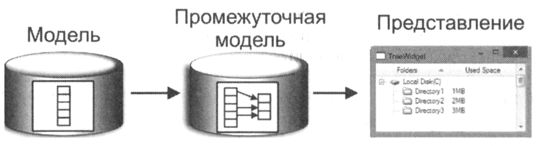

В оригинальной модели может получиться так, что какой-либо из элементов находится первым,
а нам нужно поместить его в конец или в середину. Изменение расположения данных
в оригинальной модели данных вызовет изменения во всех присоединенных представлениях,
что может быть нежелательно. В подобных случаях нам понадобится промежуточная
модель. Промежуточная модель - это модель, находящаяся между моделью данных и
представлением.

Такая модель предоставляет возможность выполнять манипуляции
с данными, при этом не изменяя данные оригинальной модели.

С помощью промежуточной модели можно выполнить сортировку или перестановку данных.
Таким образом можно сделать два представления: одно из которых показывает измененные
данные, а другое - оригинальные.

Еще одна полезная операция, которую можно выполнить с помощью промежуточной модели,
- это отбор элементов данных, то есть их фильтрация. Для этого в промежуточной
модели необходимо установить критерии, с помощью которых будет осуществляться отбор.

При отборе модель возвращает индексы только тех строк, для которых текст в столбце соответствует
указанному критерию. При сортировке порядок расположения осуществляется
в соответствии со значениями элементов, расположенных в каждом столбце. Сортировку
каждого столбца можно проводить по возрастанию и убыванию.
