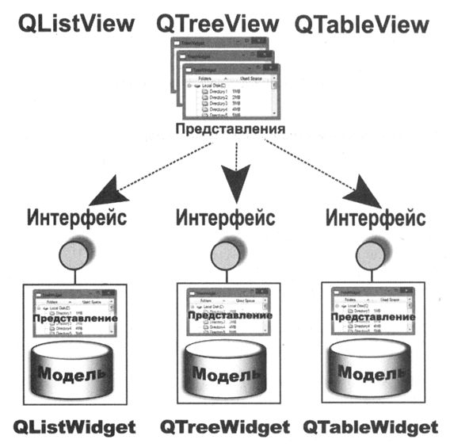

Классы элементно-ориентированного подхода,
работают по принципу: создать элемент с данными и вставить его в представление.
Данные содержатся в самих элементах. Этих классов три (с постфиксом Widget):

- QListWidget,
- QTreeWidget
- и QTaЬleWidget.

Эти три класса тоже основаны на архитектуре «модель-представление» и
унаследованы от классов представлений QListView, QTreeView и QTableView.
Но, в отличие от этих классов, внутри себя они имеют свою собственную, встроенную модель
данных. А это значит, что данные элементно-ориентированных классов можно разделять
с другими представлениями, для чего нужно лишь получить указатель на
эту модель данных, который возвращает метод QAЬstractitemView::model().

Подобный механизм разделения моделей данных виджетов элементно-ориентированного
подхода с представлениями не рекомендуется с позиции «модель-представление», но для
простых ситуаций он вполне приемлем и может помочь сэкономить время, если в программе
уже имеется реализация элементно-ориентированных классов.
