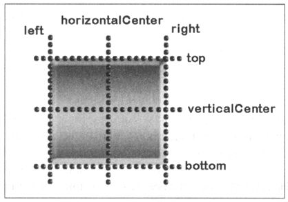
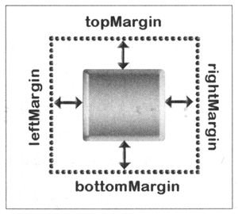

# Фиксаторы

Элементы QML практически всегда вложены друг в друга, то есть один элемент содержит
другие элементы, и каждый элемент расположен относительно своего родителя.

Фиксатор (anchor) задает позиции одного элемента относительно других.
Его принцип работы таков: вы сами определяете расположение элементов относительно фиксатора.

Cвойства координат элементов для фиксации:



Отступы от краев элемента можно задать при помощи свойств ```topMargin```, ```bottomМargin```,
```leftMargin``` и ```rightMargin```, которые определены в свойстве ```anchors```:


